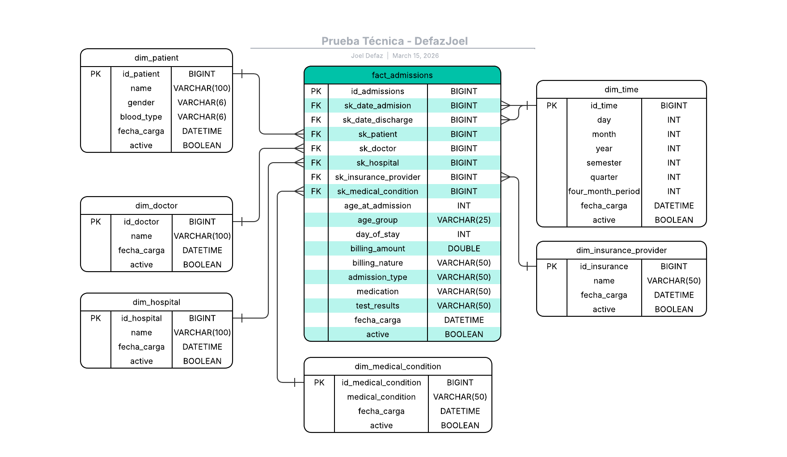

# Data Warehouse — Admisiones Hospitalarias

Modelo estrella dimensional construido sobre PostgreSQL (Supabase) para análisis de registros hospitalarios (~55,000 filas).

## Autor

**Jose Defaz**
josejoel.defaz@gmail.com

---

## Preguntas de negocio

| ID | Pregunta |
|----|----------|
| Q1 | ¿Cuál es el volumen total de registros por mes? ¿Hay estacionalidad? |
| Q2 | ¿Cuáles son los 10 pacientes o condiciones con mayor valor generado? |
| Q3 | ¿Cuál es el tiempo promedio entre admisión y alta? |
| Q4 | ¿Qué porcentaje de registros tiene resultado anormal o incidencia negativa? |
| Q5 | ¿Cuál es el costo promedio de atención por condición médica, aseguradora o tipo de admisión? |

---

## Modelo estrella
[Modelo Dimensional](./docs/ModeloDimensional.pdf) diseñado para responder a las preguntas de negocio con un balance entre normalización y simplicidad.

## Del CSV al modelo estrella

El dataset fuente tiene 15-16 columnas. El primer paso fue analizar cuáles representan **entidades del mundo real** que se pueden separar como dimensiones, y cuáles son **métricas o atributos del evento** que deben quedarse en la tabla de hechos.

Se eligió un **modelo estrella** en lugar de copo de nieve porque para este volumen de datos (~55k registros) la desnormalización de dimensiones simplifica las consultas sin impacto relevante en almacenamiento. Un copo de nieve añadiría joins innecesarios sin beneficio real.

### Identificación de dimensiones

**`dim_time` — Dimensión tiempo**

Todo modelo dimensional tiene una dimensión tiempo. El CSV tenía dos fechas: `date_of_admission` y `discharge_date`. De ahí se derivan: `day`, `month`, `year`, `semester`, `quarter`, `four_month_period`. Al tener dos fechas distintas en el evento, la fact referencia dos veces esta misma dimensión mediante `sk_date_admision` y `sk_date_discharge`, lo que permite filtrar por fecha de ingreso o de alta de forma independiente y calcular días de estancia entre ambas.

**`dim_patient` — Dimensión paciente**

Todo modelo que involucra personas extrae una dimensión de ese tipo. Se tomaron los atributos estables del paciente: `name`, `gender`, `blood_type`. La edad **no se incluyó** aquí (ver decisión sobre `age_at_admission` en la sección de fact).

**`dim_doctor` — Dimensión médico**

Se extrajo para poder filtrar y agrupar por médico tratante. Actualmente solo tiene `name`, pero es extensible a especialidad, tipo (público/privado), hospital principal asignado, entre otros.

**`dim_hospital` — Dimensión hospital**

Se extrajo para analizar por institución. Actualmente tiene `name` y es extensible a tipo de hospital (público/privado), región, capacidad, etc.

**`dim_insurance_provider` — Dimensión aseguradora**

Aunque solo tiene 5 valores únicos en el dataset actual, se extrajo como dimensión porque una aseguradora es una entidad del mundo real extensible con atributos como tipo de cobertura, región de operación, nivel de plan, etc. Dejarlo desnormalizado en la fact limitaría ese crecimiento futuro.

**`dim_medical_condition` — Dimensión condición médica**

Tiene 6 valores únicos pero es una entidad extensible con código ICD-10, nivel de severidad, categoría clínica (crónica/aguda), especialidad médica asociada, etc. Por eso se promovió a dimensión en lugar de desnormalizarse en la fact.

---

## Tabla de hechos — `fact_admissions`

La tabla central del modelo. Contiene las claves foráneas hacia todas las dimensiones y las variables que representan el evento de admisión.

### Claves foráneas (surrogate keys)

El dataset no traía identificadores propios, por lo que se generaron **surrogate keys (SK)** en el ETL para cada dimensión:

| Clave | Referencia |
|-------|-----------|
| `sk_date_admision` | `dim_time` — fecha de ingreso |
| `sk_date_discharge` | `dim_time` — fecha de alta |
| `sk_patient` | `dim_patient` |
| `sk_doctor` | `dim_doctor` |
| `sk_hospital` | `dim_hospital` |
| `sk_insurance_provider` | `dim_insurance_provider` |
| `sk_medical_condition` | `dim_medical_condition` |

### Variables calculadas y derivadas

**`age_at_admission`**

La edad se dejó en la fact y no en `dim_patient` por una razón concreta: si un paciente llega con 18 años y vuelve dos años después, actualizar la dimensión haría que el registro de la primera admisión mostrara 20 años, lo cual es incorrecto. Al guardar la edad en la fact se preserva la edad exacta al momento de cada evento, independientemente de cuántas veces regrese el mismo paciente.

**`age_group`**

Variable derivada calculada en el ETL a partir de `age_at_admission`. Clasifica al paciente en 7 categorías basadas en estándares de la OMS para facilitar el análisis en visualizadores sin necesidad de definir rangos en cada consulta:

| Grupo | Rango |
|-------|-------|
| Lactante | 0 – 2 años |
| Primera infancia | 3 – 4 años |
| Niño | 5 – 11 años |
| Adolescente | 12 – 17 años |
| Adulto joven | 18 – 25 años |
| Adulto | 26 – 59 años |
| Adulto mayor | >= 60 años |

**`day_of_stay`**

Variable derivada calculada como la diferencia entre `discharge_date` y `date_of_admission`. Permite obtener directamente el tiempo de internación sin calcular diferencias de fechas en cada consulta. Responde Q3.

**`billing_amount`**

El dataset original tenía valores positivos y negativos. Tras analizar la lógica de negocio se determinó que:

- **Valor positivo** → ingreso para el hospital (el paciente pagó)
- **Valor negativo** → ajuste (devolución al paciente, por ejemplo cuando el seguro cubre más de lo cobrado y el hospital debe devolver la diferencia)

No es necesariamente una pérdida para el hospital, sino parte del flujo de caja normal cuando intervienen aseguradoras.

**`billing_nature`**

Variable categórica derivada del signo de `billing_amount`:

- `Ingreso` → valor positivo
- `Ajuste` → valor negativo

Se agregó para evitar confusión visual en dashboards, ya que un valor negativo en dinero parece un error de inserción. Con esta variable se puede filtrar ingresos reales de devoluciones sin depender del signo del número.

### Atributos desnormalizados

Los siguientes atributos tienen baja cardinalidad y no tienen atributos descriptivos adicionales esperados, por lo que se desnormalizaron directamente en la fact:

| Atributo | Valores únicos | Razón |
|----------|---------------|-------|
| `admission_type` | 3 | Enum estable, describe el tipo de evento |
| `medication` | 5 | Enum estable para este dataset |
| `test_results` | 3 | Resultado del evento, no una entidad |
| `billing_nature` | 2 | Derivado del signo de `billing_amount` |

### Variable eliminada — `room_number`

`room_number` tenía 400 valores únicos pero ningún atributo adicional que aportara contexto analítico. Saber que varias personas pasaron por el cuarto 302 no responde ninguna de las preguntas de negocio. Para que tuviera valor analítico se necesitaría contexto adicional como si ese cuarto es de cirugías, de maternidad, de UCI, etc. Al no tener ese contexto en el dataset, la variable se eliminó del modelo. Si en el futuro se agrega ese contexto, se puede crear una `dim_room`.

---

## Variables de control

Todas las tablas incluyen dos columnas de control estándar:

| Variable  | Descripción |
|----------|-------------|
| `fecha_carga`  | Timestamp de inserción en el DW |
| `active` | 1 = registro vigente, 0 = reemplazado |

`active` está preparado para soportar **SCD Tipo 2** en el futuro si se requiere historial de cambios en dimensiones como `dim_patient`.
st_results IN ('Normal', 'Abnormal', 'Inconclusive'))