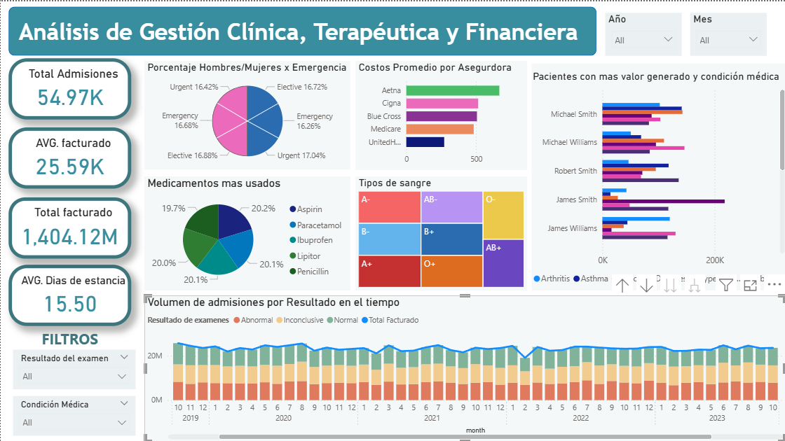
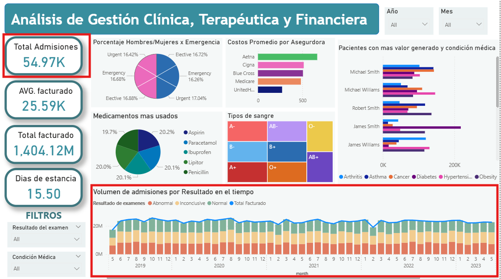
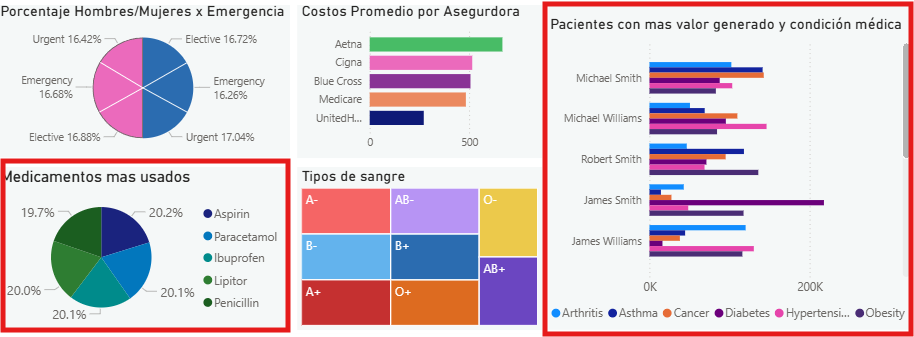
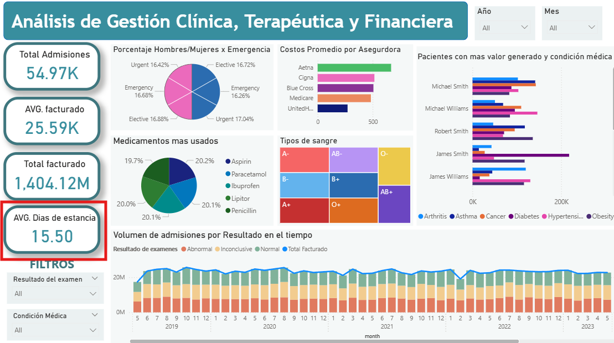
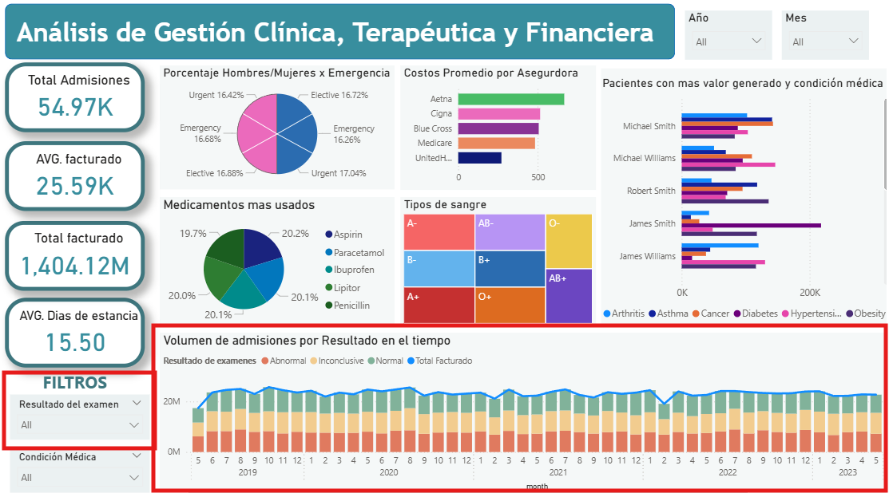
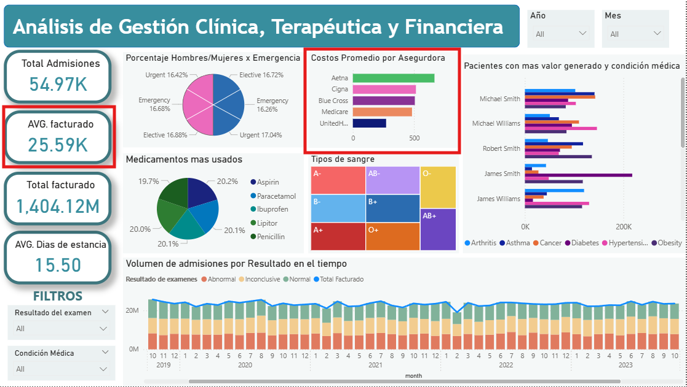
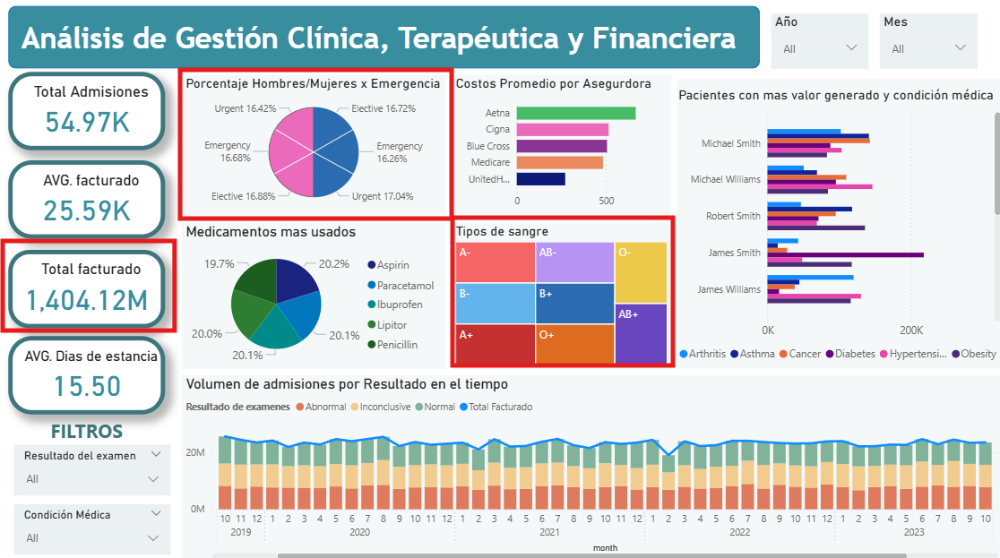

# Reporte de Visualización: Análisis de Gestión Clínica, Terapéutica y Financiera

## Autor

**Jose Defaz**
josejoel.defaz@gmail.com

---

Con los datos limpios del [Modelo Dimensional](../Fase3_DByETL/docs/ModeloDimensional.pdf) y las preguntas propuestas, se ha diseñado el siguiente visualizador con ayuda de **Power BI**.

---

## 📊 Visualización General del Dashboard

*Figura 1: Vista general del tablero de control clínico y financiero.*

El dahsboard para su visualizacion se puede revisar en el archivo: [Dashboard Power BI](./PruebaTécnica_DefazJoel.pbix))

---

## 🔍 Análisis por Pregunta de Negocio

### Pregunta 1: ¿Cuál es el volumen total de transacciones/registros por mes? ¿Hay estacionalidad?

**Visualización:**
* Gráfico de áreas/barras apiladas: **Volumen de admisiones por Resultado en el tiempo**.
* KPI Superior Izquierdo: **Total de admisiones**.

**Descripción:**
* Este gráfico muestra el histórico de datos desde el año 2019 hasta mediados de 2023.
* Las barras representan la cantidad de admisiones mensuales segmentadas por el resultado del examen.
* Se incluye una línea de tendencia del monto facturado para correlacionar volumen vs. ingresos.
* El dashboard permite filtrar por **Año** y **Mes** mediante los segmentadores superiores.

**Interpretación:**
> Se observa una tendencia bastante estable a lo largo de los años. No se aprecian picos o caídas drásticas que sugieran una estacionalidad marcada (como aumentos estacionales por gripes), lo que indica una demanda constante de servicios. El volumen total consolidado es de **54.87K** admisiones.

---

### Pregunta 2: ¿Cuáles son los 10 clientes, productos o categorías con mayor valor generado?

**Visualización:**
* Gráfico de barras horizontales: **Pacientes con mas valor generado y condición médica**.
* Gráfico de dona: **Medicamentos mas usados**.

**Descripción:**
* El gráfico de barras identifica nominalmente a los pacientes que representan el mayor valor facturado, desglosando dicho valor por su patología (Artritis, Diabetes, etc.).
* El gráfico de dona muestra la rotación de los 5 medicamentos principales.

**Interpretación:**
> Esto permite identificar no solo quién genera más ingresos, sino qué patologías están asociadas a esos altos costos (por ejemplo, casos de Diabetes y Obesidad en pacientes de alto valor). Los medicamentos están distribuidos de forma equitativa, liderados por la **Aspirina (20.2%)** y el **Paracetamol (20.1%)**.

---

### Pregunta 3: ¿Cuál es el tiempo promedio entre eventos clave del flujo?

**Visualización:**
* Tarjeta de KPI: **Dias de estancia**.

**Descripción:**
* Calcula el promedio de días transcurridos desde el ingreso del paciente hasta su egreso efectivo.

**Interpretación:**
> El tiempo promedio de estancia es de **15.54 días**. Este es un indicador crítico de eficiencia operativa; un aumento en este número podría sugerir cuellos de botella en el flujo de alta o complicaciones en los tratamientos protocolizados.

---

### Pregunta 4: ¿Qué porcentaje de registros tiene algún tipo de incidencia o resultado negativo?

**Visualización:**
* Segmentación por colores en gráfico inferior y filtro de **Resultado del examen**.

**Descripción:**
* Las métricas se categorizan en "Abnormal", "Inconclusive" y "Normal".

**Interpretación:**
> El color **salmón/rojo (Abnormal)** en el gráfico de volumen representa los resultados negativos o incidencias clínicas. Al observar la distribución visual, se confirma que una porción significativa de las admisiones mensuales resultan en hallazgos anormales, lo que justifica la necesidad de un seguimiento terapéutico intensivo y recursos especializados.

---

### Pregunta 5: ¿Cuál es el costo promedio de atención por condición médica, aseguradora o tipo de admisión?

**Visualización:**
* Gráfico de barras: **Costos Promedio por Aseguradora**.
* Tarjeta de KPI: **AVG. facturado**.

**Descripción:**
* El KPI presenta el ticket promedio general de facturación (**25.59K**).
* El gráfico de barras permite comparar el costo promedio entre diferentes proveedores de salud.

**Interpretación:**
> La aseguradora **Aetna** presenta el costo promedio más elevado, seguida de cerca por **Cigna**. Esta vista permite al área financiera negociar mejores tasas y convenios con las aseguradoras basándose en el costo real de los servicios prestados.

---

## 📈 Gráficos y Métricas Adicionales

### 1. Gestión de Recursos (Tipos de sangre)
Se utiliza un **Treemap** para visualizar la distribución de los tipos de sangre de los pacientes. 
* **Utilidad:** Gestión de stock en el banco de sangre y preparación para procedimientos quirúrgicos según el perfil de la población atendida.

### 2. Perfil demográfico (Hombres/Mujeres x Emergencia)
Gráfico de dona que muestra la distribución de género en ingresos por emergencia. Ayuda a identificar patrones demográficos en situaciones de atención crítica.

### 3. KPI Financiero: Total Facturado
* **Monto:** **1,404.12M**
* **Nota:** Esta métrica representa los ingresos brutos generados por admisiones. Se han excluido registros de tipo "Ajuste" (devoluciones o pagos a pacientes/aseguradoras) para mantener la integridad del análisis de ingresos directos.

---